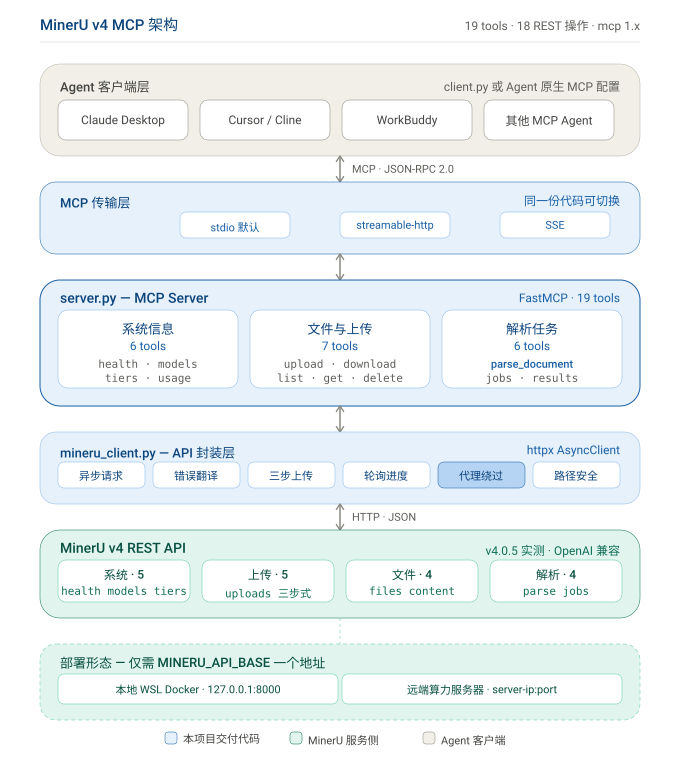

# MinerU v4 MCP Server & Client

把 **MinerU v4** 文档解析服务（PDF / 图片 → Markdown / JSON / HTML / LaTeX / DOCX / ZIP）的全部 REST API 能力，封装为标准 **MCP（Model Context Protocol）** 工具。

任何支持 MCP 的 Agent —— Claude Desktop、Cursor、Cline、WorkBuddy、Cherry Studio 等 —— **填一个 API 地址即可调用全部功能**，本地 WSL Docker 与远端算力服务器之间切换不需要改一行代码。

| | |
|---|---|
| **对接目标** | 本地 WSL Docker 部署 / 远端算力服务器部署的 MinerU v4 |
| **实测版本** | MinerU API **v4.0.5**（OpenAI 兼容风格，18 个 REST 操作 / 15 个路径） |
| **协议实现** | `mcp` Python SDK **1.30.0**（1.x 系列，生态最广） |
| **交付工具** | **19 个** MCP 工具，全部经实测 |
| **测试状态** | **26/26 断言通过**，stdio / streamable-http / CLI 三种形态均验证 |
| **代码规模** | 1572 行 Python（server 581 + client 511 + 通用客户端 360 + 测试 120） |

---

## 目录

- [快速开始](#快速开始)
- [它解决什么问题](#它解决什么问题)
- [工具清单（19 个）](#工具清单19-个)
- [典型用法](#典型用法)
- [配置项](#配置项)
- [架构](#架构)
- [开发过程](#开发过程)
- [Client 的三种形态](#client-的三种形态)
- [测试与验证](#测试与验证)
- [已知边界](#已知边界)
- [目录结构](#目录结构)
- [相关文档](#相关文档)

---

## 快速开始

```bash
# 1. 装依赖（务必独立 venv）
cd mineru-mcp
python -m venv .venv && source .venv/bin/activate    # Windows: .venv\Scripts\activate
pip install -r requirements.txt

# 2. 确认 MinerU 可达
curl http://127.0.0.1:8000/v1/health

# 3. 一键端到端自检（17 项）
python client.py --api-base http://127.0.0.1:8000 test --pdf dev/tiny.pdf
#    → ========== 自检结果: 17 passed, 0 failed ==========
```

**接入 Agent**（以 Claude Desktop / Cline 为例，其他客户端结构相同）：

```json
{
  "mcpServers": {
    "mineru": {
      "command": "C:/path/to/python.exe",
      "args": ["D:/Agent-Work/mineru-mcp/server.py"],
      "env": { "MINERU_API_BASE": "http://127.0.0.1:8000" }
    }
  }
}
```

**换远端算力服务器**：只把 `MINERU_API_BASE` 改成 `http://<server-ip>:<port>`，网关开了鉴权再加 `MINERU_API_KEY`。代码零改动。

> 完整部署步骤（三种部署形态、systemd 常驻、各 Agent 对接详解、验证清单与故障排查）见 **[docs/DEPLOYMENT.md](docs/DEPLOYMENT.md)**。

---

## 它解决什么问题

MinerU 本身很好用，但它说的是 REST 的语言：十八个操作、三步式上传、异步任务加轮询、产物只是一串 `file_id` 引用。让 Agent 自己啃这套流程，等于要求它先当一回 API 工程师 —— 记住端点顺序、算 SHA256、判断 202 与终态、再逐个下载产物。中间任何一步走错，它拿到的就是一坨 HTTP 状态码。

这个 MCP 把这层认知负担整体接了过来。Agent 只需表达意图：「把这份 PDF 变成 Markdown」。

背后发生的事：创建任务 → 每两秒轮询并通过 MCP `report_progress` 推送进度 → 终态后遍历 `output_files` 引用逐个取回内容 → 落盘并内联文本返回。Agent 一次调用拿到全部结果。

> 完整叙事见 **[docs/narrative.md](docs/narrative.md)**。

---

## 工具清单（19 个）

Server 把 MinerU v4 的 18 个 REST 操作映射并增强为 19 个面向 Agent 的工具。返回值统一为 `{"ok": true, "data": ...}` 或 `{"ok": false, "error": {...}}`。

### 系统信息（6）

| 工具 | 对应 API | 说明 |
|---|---|---|
| `mineru_server_info` | 聚合 health+tiers+models+usage | **首次使用先调它**，一次拿全服务能力 |
| `mineru_health` | `GET /v1/health` | 版本、启用的输出格式与输入源 |
| `mineru_list_models` | `GET /v1/models` | 可用解析模型列表 |
| `mineru_get_model` | `GET /v1/models/{model}` | 单模型详情 |
| `mineru_list_tiers` | `GET /v1/tiers` | 档位：flash / basic / standard / advanced |
| `mineru_get_usage` | `GET /v1/usage` | 用量与限额（并发数、文件大小上限等） |

### 文件与上传（7）

| 工具 | 对应 API | 说明 |
|---|---|---|
| `mineru_upload_file` | 三步上传封装 | 本地文件 → `file_id`，自动 SHA256 校验 |
| `mineru_get_upload` | `GET /v1/uploads/{id}` | 查询上传状态 |
| `mineru_cancel_upload` | `POST /v1/uploads/{id}/cancel` | 取消进行中的上传 |
| `mineru_list_files` | `GET /v1/files` | 文件列表（游标分页 + purpose 过滤） |
| `mineru_get_file` | `GET /v1/files/{id}` | 文件元数据 |
| `mineru_delete_file` | `DELETE /v1/files/{id}` | 删除文件（不可恢复） |
| `mineru_download_file` | `GET /v1/files/{id}/content` | 下载任意文件到本地 |

### 解析任务（6）

| 工具 | 对应 API | 说明 |
|---|---|---|
| **`mineru_parse_document`** | 创建 + 轮询 + 下载全流程 | **主入口·一步式**：提交 → 等待 → 下载 → 内联内容 |
| `mineru_create_parse_job` | `POST /v1/parse/jobs` | 异步创建，立即返回 job_id（最多 100 文件/次） |
| `mineru_get_parse_job` | `GET /v1/parse/jobs/{id}` | 查询状态与产物引用 |
| `mineru_list_parse_jobs` | `GET /v1/parse/jobs` | 任务列表（游标分页 + 状态过滤） |
| `mineru_cancel_parse_job` | `DELETE /v1/parse/jobs/{id}` | 取消排队/运行中任务 |
| `mineru_download_job_results` | 遍历 output_files | 批量下载任务产物到本地 |

---

## 典型用法

### A. 一步式解析（最常用）

`mineru_parse_document` 支持四种输入源：

```jsonc
// 1) 远程 URL —— 本地部署最省事
{ "source": {"type": "url", "url": "https://example.com/paper.pdf"} }

// 2) 已上传文件 —— 先用 mineru_upload_file 拿 file_id（最稳妥，不依赖服务端配置）
{ "source": {"type": "file_id", "file_id": "file-xxxx"} }

// 3) 内联 base64 —— 小文件（受服务端 --max-inline-bytes 限制，默认 1MB）
{ "source": {"type": "inline", "name": "x.pdf", "data": "<base64>" } }

// 4) 本地路径 —— 需服务端开启 --allow-local-source，且为容器内路径
{ "source": {"type": "local", "path": "/data/x.pdf"} }
```

完整参数：

```jsonc
{
  "source": {"type": "url", "url": "https://example.com/paper.pdf"},
  "tier": "standard",                 // flash / basic / standard / advanced
  "ocr_mode": "auto",                 // auto / txt / ocr
  "output_formats": ["markdown", "middle_json"],
  "page_range": "1-10",               // 可选；支持 "1-5,8,r3-r1"、"all"
  "wait": true,                       // true=同步等待；false=立即返回 job_id
  "timeout": 600,
  "download": true,                   // 产物落盘到 output_dir
  "return_content": true,             // 文本类产物内联返回
  "max_content_chars": 20000
}
```

### B. 异步长任务（大文档 / 批量）

```
mineru_create_parse_job(sources=[...], tier="advanced")   → job_id
mineru_get_parse_job(job_id)                              → 轮询 status
# status ∈ {completed, partial} 后：
mineru_download_job_results(job_id, output_dir="...")     → 落盘全部产物
```

> ⚠️ 服务端 `--concurrency` 默认为 **1**，批量提交会排队。请串行提交，或调大服务端并发。

---

## 配置项

环境变量与 CLI 参数双通道，**CLI 优先**。

| 环境变量 | CLI 参数 | 默认值 | 说明 |
|---|---|---|---|
| `MINERU_API_BASE` | `--api-base` | `http://127.0.0.1:8000` | MinerU API 地址（本地/远端） |
| `MINERU_API_KEY` | `--api-key` | 空 | 远端网关 Bearer Token，本地无需 |
| `MINERU_OUTPUT_DIR` | `--output-dir` | `./mineru_outputs` | 解析产物默认保存目录 |
| `MINERU_TIMEOUT` | `--timeout` | `60` | HTTP 超时秒数 |
| `MINERU_VERIFY_SSL` | `--insecure`（反向） | `1` | TLS 校验，自签名远端设 0 |
| `MINERU_USE_PROXY` | `--use-proxy` / `--no-proxy` | 自动 | 见下方代理说明 |
| `MINERU_HEADERS` | — | 空 | 额外自定义请求头（JSON 对象） |

传输层：`--transport stdio|streamable-http|sse`，配 `--host` / `--port`（默认 `127.0.0.1:8765`）。

### 代理自动绕过（重要）

`httpx` 默认 `trust_env=True`，会把系统 `http_proxy` 应用到**所有**请求 —— 包括发往 `127.0.0.1` 的。在企业网络 / 透明代理环境下，代理通常无法回连本机，于是「本地 WSL Docker 部署」这个最主流的场景直接连不上，**且报错来自代理（一个令人困惑的 502），根本看不出症结**。

本项目已内置修复：解析 base_url 主机名，凡回环或私网网段（`127.x`、`10.x`、`172.16-31.x`、`192.168.x`、`169.254.x`、`localhost`、`::1`）自动关闭 `trust_env` 直连；公网地址保留环境代理。需强制时用 `MINERU_USE_PROXY=0/1` 或 `--no-proxy`。

---

## 架构



六层结构（自上而下）：

| 层 | 组件 | 职责 |
|---|---|---|
| 1. Agent 客户端层 | Claude Desktop / Cursor / Cline / WorkBuddy，或本项目 `client.py` | 发起 MCP 调用 |
| 2. MCP 传输层 | stdio（默认）/ streamable-http / SSE | JSON-RPC 2.0 承载 |
| 3. MCP Server | `server.py`（FastMCP，19 tools） | 工具编排、参数校验、结构化返回 |
| 4. API 封装层 | `mineru_client.py`（httpx AsyncClient） | 异步请求、错误翻译、三步上传、轮询进度、代理绕过、路径安全 |
| 5. MinerU v4 REST API | 18 操作：系统 5 / 上传 5 / 文件 4 / 解析 4 | 实际解析引擎 |
| 6. 部署形态 | 本地 WSL Docker 或远端算力服务器 | 仅切换 `MINERU_API_BASE` |

终端降级视图：

```
┌─────────────┐  MCP(stdio/http)  ┌──────────────┐  REST/HTTP  ┌────────────────┐
│ Agent 工具   │ ────────────────► │  server.py   │ ──────────► │  MinerU v4 API  │
│ Claude/...  │ ◄──────────────── │  (19 tools)  │ ◄────────── │  :8000 /v1/...  │
└─────────────┘   JSON-RPC 2.0    └──────┬───────┘             └────────────────┘
                                          │
                                   mineru_client.py
                              (异步 httpx · 错误翻译 · 三步上传
                               · 轮询 · 代理绕过 · 路径安全)
```

**设计要点**

- **零硬编码地址** —— API 地址全部来自配置，本地/远端只改一个值
- **错误统一翻译** —— MinerU 的 `{"error":{type,code,message,param}}`、FastAPI 的 `422 {"detail"}`、网络层超时/拒连/DNS 失败，三种异构结构全部收敛为 `{"ok":false,"error":{...}}`。Agent 判断一个字段知道成败，读 message 知道怎么纠正
- **三步上传封装** —— `create → PUT content(octet-stream) → complete`，自动算 SHA256、优先使用服务端返回的 `upload_url`（兼容云模式对象存储直传）、上传前先查 `max_file_size_bytes` 本地拒绝超限文件
- **异步轮询 + 协议内进度** —— `wait_job` 轮询到终态（completed/partial/failed/canceled）或超时；进度经 MCP 原生 `report_progress` 上报，不靠打印日志
- **路径安全** —— 落盘文件名统一经 `safe_filename()` 清洗，防 ZIP 条目名路径穿越
- **stdio 洁净** —— 所有日志走 stderr，绝不污染 stdout 的 JSON-RPC 流

---

## 开发过程

这套东西不是照文档抄出来的，而是**逆向 + 实测**出来的。记录几个关键节点。

### 1. 从 OpenAPI 规范反推语义

先抓 `/openapi.json`（32 KB），解析出 15 个路径 / 18 个操作 / 38 个 Schema。但规范只说了「有什么」，没说「怎么用」。于是写探针脚本逐个验证真实行为：

- 上传到底是几步？`CreateUploadRequest` 要 `filename/bytes/mime_type`，但字节怎么传？→ 实测确认是 `PUT .../content` 发 `application/octet-stream` 裸字节，且响应里带 `upload_url` 与 `upload_headers`（云模式直传用）
- `complete` 之后 `file` 字段才有值，`file_id` 从这里取
- 产物不是内联的，而是 `OutputFileRef{file_id, bytes}`，得再走 Files API 下载

这些细节在文档里是散的，只有跑一遍才拼得起来。

### 2. 边界行为靠撞

主动构造错误请求，把服务端的真实反应记下来，才能让工具给出有意义的错误：

| 构造 | 实测响应 |
|---|---|
| 取消已完成的任务 | `409 job_already_terminal` |
| 页码倒序 `5-1` | `400 page_range_invalid` |
| `local` 源 | `400 unsupported_source`（提示需 `--allow-local-source`） |
| 不存在的 job / file | `404 job_not_found` / `file_not_found` |
| 文件下载 | `application/octet-stream`，云模式 `302` → CDN |

于是 `cancel_parse_job` 的实现把「取消成功」和「已终态 409」都视为正确行为 —— 因为对 Agent 来说两者都意味着「不用再等了」。

### 3. 撞上一个真实的坑：代理

自检时有一项「不可达地址应返回连接错误」，结果拿到的是 `502 upstream connect failed`。这个 502 不是 MinerU 发的 —— 环境里有 `http_proxy=127.0.0.1:27179`，`httpx` 默认 `trust_env=True` 把发往 `127.0.0.1:9999` 的请求也交给了代理，代理连不上就回 502。

这在开发机上只是个测试失败，但在**用户的真实环境里是致命的**：企业网络 + 透明代理 + 本地 WSL Docker 部署 = 直接连不上，而且报错完全指向错误方向。

修复方式是在客户端构造时判定主机名：回环与私网网段自动 `trust_env=False`，公网保留代理。加单元测试覆盖 8 种主机形态，并保留 `MINERU_USE_PROXY` 强制开关。

### 4. SDK 版本选择

装依赖时先拿到 `mcp 2.2.0`，导入即报错 —— 2.x 把 `FastMCP` 重构成了 `MCPServer`，API 全面变动。而用户要求「适合在所有 Agent 工具使用」，当前主流客户端实现仍围绕 1.x 的 stdio 协议。于是降到 `mcp<2`（实测 1.30.0），并在 `requirements.txt` 里钉死上界，附注释说明原因。

### 5. 一个容易漏的细节

`mineru_parse_document` 需要 `Context` 来上报进度。FastMCP 通过类型注解自动注入，但如果忘了在签名里声明 `ctx: Context`，运行时会 NameError。修好后专门加了一条断言：**验证 `ctx` 没有泄漏到客户端看到的 inputSchema 里** —— 否则 Agent 会以为这是个必填参数。

### 6. 用真实文档收尾

`tiny.pdf`（540 字节手工构造）只能验证链路通不通。最后拿一份 632KB、13 页的中文 PDF 跑 standard 档位：两页范围 1488 毫秒，Markdown 里目录层级、标题、正文全部正确还原；整本约 65 秒。这也顺带验证了 `page_range` 真的生效。

---

## Client 的三种形态

`client.py` 既是测试工具，也是可复用的客户端库。

```bash
# 1) 端到端自检（17 项）
python client.py --api-base http://127.0.0.1:8000 test --pdf dev/tiny.pdf

# 2) 交互式 REPL
python client.py --api-base http://127.0.0.1:8000 shell
mineru> tools
mineru> schema mineru_parse_document
mineru> call mineru_parse_document {"source":{"type":"url","url":"..."}}

# 3) 单次调用（便于其他语言的 Agent 通过子进程驱动）
python client.py --api-base http://127.0.0.1:8000 call mineru_list_tiers
```

作为库嵌入自己的 Agent：

```python
from client import MinerUMCPClient

async with MinerUMCPClient(api_base="http://127.0.0.1:8000") as cli:
    res = await cli.parse_document(
        {"type": "url", "url": "https://.../x.pdf"}, tier="standard")
    print(res["data"]["outputs"])
```

`call_tool()` 会自动把 MCP 的 `content[].text` 反解为 Python 对象，`isError=True` 时抛 `RuntimeError`。

---

## 测试与验证

**19 个工具 100% 覆盖，26/26 断言通过。**

| 套件 | 断言 | 覆盖内容 |
|---|---|---|
| `client.py test` | 17 | 连通、工具清单、health、聚合 info、tiers/models/usage、文件列表分页、任务列表、404 错误翻译、一步式解析并落盘、文件 get/download/delete 全链、异步 create→get→download |
| `coverage_test.py` | 9 | 单模型查询与 404、三步上传、file_id 源解析、上传不存在文件的边界、任务取消的 canceled/409 双语义、上传状态查询与取消 |

**传输形态**：stdio（拉起子进程完整跑通）、streamable-http（独立进程监听 8765，客户端成功 initialize 并调用）、CLI 单次调用（输出结构化 JSON）。

**附加校验**：19 个工具的 JSON Schema 全部可序列化且 `ctx` 未泄漏；SVG/XML 类交付物做 well-formedness 检查；代理绕过逻辑 8 种主机形态单测通过。

复现：

```bash
python client.py --api-base http://127.0.0.1:8000 test --pdf dev/tiny.pdf
python coverage_test.py --api-base http://127.0.0.1:8000
```

> 两个测试脚本都支持 `--api-base`（或环境变量 `MINERU_API_BASE`），远端部署时指向你的服务器地址即可。

---

## 已知边界

诚实说明做不到或依赖服务端配置的部分。

| 项 | 说明 |
|---|---|
| **并发为 1** | 服务端 `--concurrency` 默认 1。批量提交会排队；轮询超时设太短会报 `poll_timeout`，但**任务没丢**，可用 `get_parse_job` 继续查 |
| **local 源默认关闭** | 服务端未加 `--allow-local-source` 时返回 400。本地场景请走 `upload_file` 或 `url` / `inline` |
| **输出格式看服务端** | 协议定义 7 种，实测 v4.0.5 默认启用 4 种：`markdown`、`middle_json`、`structured_content`、`zip`。请求未启用的格式不会产出物 —— 调用前用 `mineru_health` 查 `features.output_formats` |
| **webhook 未启用** | `callback` 参数已按协议实现并保留，但实测实例 `features.webhook=false`，轮询是目前唯一可靠的完成通知方式 |
| **inline 源有上限** | 服务端 `--max-inline-bytes` 默认 1MB，超过请改用 `upload_file` |
| **匿名访问** | 当前实例无鉴权（`access_level: anonymous`）。公网暴露务必在网关层加鉴权 —— `MINERU_API_KEY` 已准备好 |

实测 API 行为速查：

| 项 | 实测结论 |
|---|---|
| 启用输出格式 | `markdown` / `middle_json` / `structured_content` / `zip` |
| 启用输入源 | `file_id` / `url` / `inline` |
| 鉴权 | 无（anonymous） |
| 并发 | `max_concurrent_jobs=1` |
| 取消已终态任务 | `409 job_already_terminal` |
| 非法页码区间 | `400 page_range_invalid` |
| 文件下载 | `application/octet-stream`，云模式 `302`→CDN（已自动跟随） |

---

## 目录结构

```
mineru-mcp/
├── server.py                  # MCP Server 主体（19 个工具，FastMCP）    581 行
├── mineru_client.py           # MinerU v4 REST API 异步客户端封装层      511 行
├── client.py                  # 通用 MCP Client（库 / test / shell / call）360 行
├── coverage_test.py           # 补充覆盖测试（5 个工具 + 边界，支持 --api-base） 120 行
├── requirements.txt           # 依赖（mcp<2, httpx, pydantic）
├── .env.example               # 环境变量样例
├── .gitignore                 # 版本控制排除规则
├── mcp_config_examples.json   # 各 Agent 工具接入配置示例
├── README.md                  # 本文档
├── docs/
│   ├── DEPLOYMENT.md          # 部署与对接指南（3 种部署形态 + 各 Agent 对接 + 排障）
│   ├── AGENT_DEPLOY_PROMPT.md # 一键部署提示词（给任意 Agent 复制使用）
│   ├── architecture.svg       # 分层架构图（六层）
│   ├── architecture.html      # 架构图浏览器预览页
│   └── narrative.md           # 功能与特点（叙事版）
└── dev/
    ├── tiny.pdf               # 自检用最小 PDF 样本（client.py test 默认输入）
    └── check_docs.py          # 文档链接/锚点一致性校验脚本
```

> 运行时会在项目下生成 `mineru_outputs/`（解析产物默认目录），已由 `.gitignore` 排除，不纳入版本库。
> 开发期的 API 逆向中间产物（openapi.json、探针脚本、schema 导出）与本机冒烟测试脚本亦不入库。

---

## 相关文档

| 文档 | 内容 |
|---|---|
| **[docs/DEPLOYMENT.md](docs/DEPLOYMENT.md)** | MCP Server 三种部署形态、五大 Agent 工具对接详解、验证清单、故障排查、服务端要点 |
| **[docs/AGENT_DEPLOY_PROMPT.md](docs/AGENT_DEPLOY_PROMPT.md)** | 一键部署提示词 —— 复制给任意 Agent 即可自动完成部署与对接 |
| [docs/narrative.md](docs/narrative.md) | 功能与特点的叙事式描述 |
| [docs/architecture.svg](docs/architecture.svg) | 六层分层架构图 |
| [mcp_config_examples.json](mcp_config_examples.json) | 八类接入场景的配置片段 |
